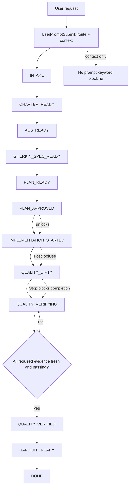

# Схема DAE pipeline

Этот документ описывает полный Disciplined Agentic Engineering pipeline для Codex plugin: от первичного intake до завершения работы с проверенными артефактами и quality evidence.

## Общая схема



## Runtime hook model

DAE не блокирует пользовательский prompt по словам. Prompt может содержать `implement`, `bypass`, `skip`, `hooks`, `quality`, `CRAP`, `ATDD` или `tests`; это не является основанием для hard block.

| Hook | Роль | Что делает |
|---|---|---|
| `SessionStart` | Контекст | Загружает DAE contract, активную feature, текущий checkpoint, missing gates и следующий допустимый шаг. |
| `UserPromptSubmit` | Router/context injector | Не блокирует prompt. Показывает текущий checkpoint, missing artifacts, разрешенные artifact-acquisition actions и запрещенные implementation/finalization actions. |
| `PreToolUse` | Hard gate до действия | Блокирует write-capable implementation/scaffold/config/test actions, если нет нужных артефактов или approvals. Разрешает planning artifacts. |
| `PostToolUse` | State updater после действия | Если были implementation-affecting edits, помечает `quality_dirty=true` и фиксирует required evidence. Не запускает тяжелые анализаторы на каждое изменение. |
| `PermissionRequest` | Capability gate | Отклоняет unsafe escalation, destructive actions, out-of-workspace writes и попытки обойти quality gates без audited override. |
| `Stop` | Completion gate | Не дает завершить работу, пока нет required artifacts и свежего passing quality evidence. |

## Этапы pipeline

| # | State / checkpoint | Что происходит | Основные артефакты | Gate для перехода дальше |
|---:|---|---|---|---|
| 0 | `NO_STATE` | В репозитории еще нет DAE state для текущей работы. | Нет обязательных артефактов. | Любой prompt может войти в intake; `UserPromptSubmit` добавляет контекст. |
| 1 | `INTAKE` | Агент собирает контекст: читает репозиторий, формулирует цель, фиксирует assumptions и unresolved decisions. | `.engineer/dae-state.json`, feature folder при необходимости. | Должен появиться charter/feature artifact. |
| 2 | `CHARTER_READY` | Зафиксированы пользовательская цель, actor/user role, scope, non-goals, assumptions и constraints. | `features/<feature>/feature.md` или `CHARTER.md` для project-start. | Acceptance criteria должны быть выведены из charter и описывать observable outcomes. |
| 3 | `ACS_READY` | Описаны acceptance criteria: success criteria, edge cases, constraints и traceability to goal. | `features/<feature>/acceptance.json` или `acs.md`. | Gherkin spec должен покрывать ACs и оставаться на уровне внешнего поведения. |
| 4 | `GHERKIN_SPEC_READY` | Поведение формализовано в Gherkin scenarios. Specs не описывают классы, private helpers, storage schema или implementation details. | `features/<feature>/spec.md`. | Нужен implementation/architecture plan. |
| 5 | `PLAN_READY` | План описывает architecture outline, implementation sequence, testing strategy, risks, quality gates и rollback/safety notes. | `features/<feature>/plan.md`. | Нужен explicit human approval или допустимый delegated goal approval. |
| 6 | `PLAN_APPROVED` | План одобрен и approval записан машинно. Implementation actions становятся допустимыми только пока approval не stale. | `.engineer/approvals.jsonl`. | `PreToolUse` начинает пропускать implementation-affecting writes. |
| 7 | `IMPLEMENTATION_STARTED` | Агент реализует изменения по approved plan. Acceptance и unit streams остаются раздельными. | Source/config/test changes по approved scope. | Любая implementation-affecting правка переводит качество в dirty state. |
| 8 | `QUALITY_DIRTY` | Требуется evidence, потому что код или runtime-affecting files менялись. | `.engineer/quality-state.json`. | Нужно записать fresh evidence для всех required gates. |
| 9 | `QUALITY_VERIFYING` | Запускаются проверки и фиксируются результаты. Heavy analyzers запускаются осознанно, не после каждого edit. | `features/<feature>/evidence/quality/*.json`. | Все required gates должны быть fresh и passing; stale/failing evidence блокирует завершение. |
| 10 | `QUALITY_VERIFIED` | Required quality evidence есть и проходит thresholds. | `quality-gate-summary.json`. | Нужен durable handoff/progress. |
| 11 | `HANDOFF_READY` | Состояние работы передано через durable artifact, а не через chat summary. | `progress.md`, `handoffs/*.md`, quality summary. | Stop может разрешить завершение, если нет dirty state и missing gates. |
| 12 | `DONE` | Работа завершена: артефакты, approvals и evidence согласованы. | Final summary / release notes при необходимости. | Новые implementation edits снова переводят pipeline в `QUALITY_DIRTY`. |

## Artifact acquisition protocol

До `PLAN_APPROVED` агенту разрешено получать недостающие документы автономно:

1. Инспектировать репозиторий и существующие conventions.
2. Драфтить charter, ACs, spec, plan, progress, handoff и evidence artifacts.
3. Явно фиксировать assumptions.
4. Задавать пользователю только unresolved decisions.
5. Запрашивать approval там, где DAE требует человеческого решения.

До approval нельзя писать implementation/scaffold/config/test files. Разрешены planning/state/evidence paths, например:

```text
.engineer/**
.dae/**
CHARTER.md
PROJECT_CHARTER.md
features/**/feature.md
features/**/acceptance.json
features/**/acs.md
features/**/spec.md
features/**/plan.md
features/**/progress.md
features/**/handoffs/**
features/**/evidence/**
docs/dae/**
```

## Implementation gate

`PreToolUse` считает implementation-affecting actions недопустимыми до `PLAN_APPROVED`, если они пишут или создают:

```text
src/**, app/**, lib/**, server/**, client/**, web/**, api/**
tests/**, __tests__/**
package.json, pyproject.toml, requirements.txt, Cargo.toml, go.mod
Dockerfile, docker-compose*.yml
*.py, *.ts, *.tsx, *.js, *.jsx, *.go, *.rs, *.java, ...
```

Решение строится по state, paths, action semantics, approvals и evidence freshness. Оно не строится по словам в prompt.

## Quality evidence gate

После implementation-affecting edit `PostToolUse` выставляет `quality_dirty=true`. До completion/release/merge/push нужны fresh machine-readable evidence files.

| Gate | Когда нужен | Evidence |
|---|---|---|
| Acceptance stream | Всегда после implementation edits | `features/<feature>/evidence/quality/acceptance.json` |
| Unit stream | Всегда после implementation edits | `features/<feature>/evidence/quality/unit.json` |
| CRAP analysis | Required by default | `features/<feature>/evidence/quality/crap.json` |
| Architecture check | Required by default | `features/<feature>/evidence/quality/arch.json` |
| Refine review | Required by default | `features/<feature>/evidence/quality/refine.json` |
| Branch hygiene | Required before completion | `features/<feature>/evidence/quality/branch-hygiene.json` |
| Progress | Required before completion | `features/<feature>/evidence/quality/progress.json` |
| Handoff | Required before completion | `features/<feature>/evidence/quality/handoff.json` |
| Duplicate detection | Required by default | `features/<feature>/evidence/quality/duplicate-detection.json` |
| Test impact | Required by default | `features/<feature>/evidence/quality/test-impact.json` |
| Generated acceptance immutability | Required when generated acceptance tests exist | `features/<feature>/evidence/quality/generated-acceptance-immutability.json` |
| Mutation | Risk-triggered or configured | `features/<feature>/evidence/quality/mutation.json` |

Evidence считается stale, если implementation-affecting files менялись после `generated_at` или после recorded workspace fingerprint.

## CRAP default

CRAP analyzer обязателен по умолчанию после implementation-affecting edits.

Default thresholds:

```json
{
  "max_crap_score": 30,
  "warn_crap_score": 20,
  "max_high_risk_findings": 0,
  "missing_coverage_policy": "assume_zero_and_fail_if_threshold_exceeded",
  "coverage_required_for_pass": true
}
```

CRAP warning, high-risk findings или configured risk trigger могут сделать mutation evidence обязательным.

## Policy overrides

Relaxation strict gates разрешается только через audited override. Override должен содержать:

- `scope`
- `justification`
- `approved_by`
- `approved_at`
- `expires_at` или `no_expiry_reason`
- affected gates

Без этих полей config validation должна падать. Override не является silent bypass.

## Completion rules

`Stop` разрешает завершение только когда:

1. Required artifacts существуют и валидны.
2. Required approvals есть и не stale.
3. `quality_dirty=false` или все dirty gates закрыты fresh passing evidence.
4. Acceptance и unit streams оба green.
5. CRAP evidence есть и проходит thresholds.
6. Architecture/refine/progress/handoff evidence есть.
7. Mutation evidence есть, если оно configured или risk-triggered.
8. Нет новых implementation edits после evidence.

Если любой пункт не выполнен, `Stop` возвращает continue/block message с точным следующим действием.
